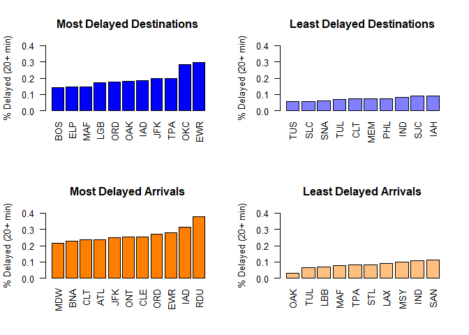
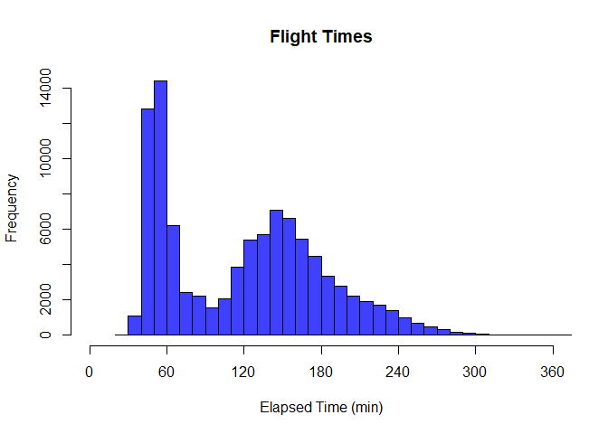
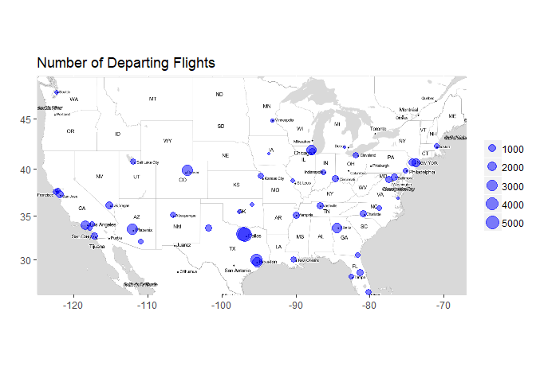
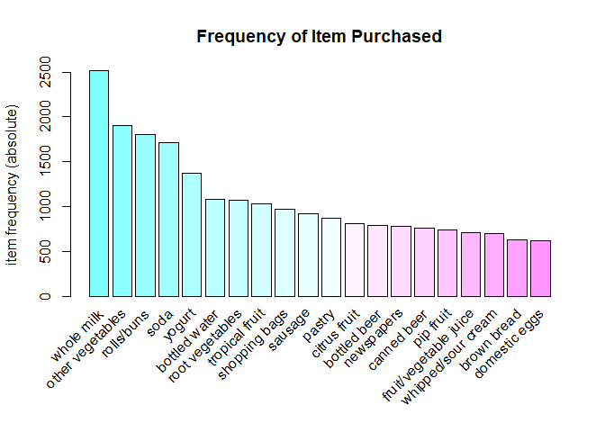
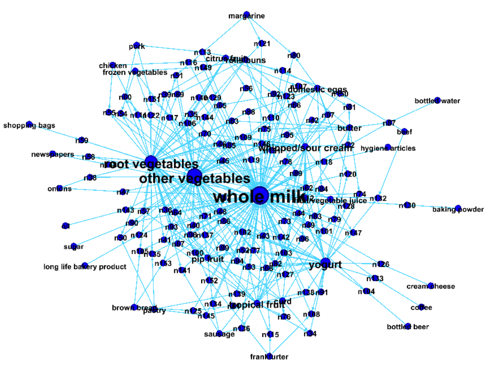

Flights at ABIA
===============

### Best Time of Day

For all of the below analysis on delayed flights, we have standardized
the number of delayed flights with the total number of flights in the
given time period, and only considered delays longer than 20 minutes. We
did not want to include a large number of trivial delays of only a few
minutes. We also separated flights departing from those arriving in
Austin with the hope of isolating delays happening at ABIA from those
all around the country. When looking at time of day, delays esspecially
for arrivals increases towards the end of the day because of the effects
from delays in previous connecting flights that day. Interestingly,
departure delays spike at 11 AM, which might be caused by heavy air
traffic as many people don't want to fly early in the morning.

### Best Day of the Week

A similar analysis was run below for delayed flights by aggregating
across the day of the week. The delay frequencies seem to follow busy
times of air travel (Friday and Sunday/Monday). While people commonly
avoid flying on weekends in general, Saturday actually shows the lowest
percentage of delayed flights while Thursday has an unexpectedly high
number of delays. Again, arrival delays are consistently more common
than departures because they have a much larger number of influencing
factors in airports around the country.

### Best Time of Year

Now looking at a weekly scale, we can see seasonal and event-driven
fluctuations in flight delays such as during the holidays, summer
vacations, and SXSW. An important observation to note that we have seen
in some form above, is that departure delays follow arrival delay
patterns almost exaclty, just to a lesser degree. If we assume a
majority of delayed departures from ABIA are caused by delayed arrivals,
the consistent difference between them can be interpreted as the arrival
delays that were compensated for at ABIA. The fall season has
significantly less delayed flights, likely to lower traffic in general.
Here we can see the gap between arrivals and departures approach zero as
the delay frequency approaches 5%. This may be the actual amount of
departures that were delayed due to issues at ABIA.

### Best Locations

Aggregating flights over the entire year, we can see the best and worst
airports in terms of flight delays to and from Austin. A majority of the
most delayed destinations are in the north of the country, which sees a
much higher rate of delays simply due to weather. As expected the
largest airports including JFK, Newark, and O'hare also show the most
flight delays going both ways. The exception to this is LAX, which shows
a surpsingly low rate of delays (under 10% overall). Other than LAX, the
least delayed airports are generally smaller than average.

### Traffic

The histogram below shows the frequency of flights based on their flight
times. The majority of flights to and from Austin are less than one
hour, most of which go through Houston and Dallas. The next peak in
number of flights is in the 2.5 hour range and major airports within
this range include Pheonix, Denver, and Chicago. The far right tail
includes the longest flights to areas in the US such as Seattle and
Boston. These inferences are supported by the map below, which shows the
number of flights departing Austin by airport. The map for flights
arriving in Austin is virtually identical.

Association Rules
=================

The plot below shows the overall prior frequencies of items in our
dataset of transactions. Whole milk is the most frequenly purchased by a
considerable margin, followed by vegetables, rolls/buns, soda, and so
on. Before looking for associations, we know that many of these items
will have to be frequently purchased together, so we would want a
significant confidence in any rules we find in predicting these items.

After trying different combinations, we decided on a support metric of
0.005 and confidence of 0.5 when creating our association rules. We also
limited the length of the item list in the each rule to five items. The
confidence was the most important factor to consider, given the high
frequency of some of the items discussed before. A confidence of 0.5
means that all rules follow the format of "Given this item list there is
at least a 50% chance of the person also buying X." These parameters
yielded a set of 120 assocation rules shown below. The highest
confidence rules have a lift of between 2 and 3 times above the prior
probabilities. There is also a large numbers of rules at this level of
lift with a confidence barely above 50%. However, we felt that 120
assocation rules provides a reasonable amount of predictive itemsets and
predicted items. Also, the highest lift rules all have relatively low
support as expected because the most informative rules should be less
common.

    ## To reduce overplotting, jitter is added! Use jitter = 0 to prevent jitter.

The rules shown below have the highest support and confidence,
respectively, and they all contain Whole Milk on the right hand side of
the rule. While we know whole milk is already the most commonly
purchased product, the lift on all of these rules is above 2, meaning
that the conditional probability of a person getting whole milk is
double that of the probability before they have any other items.

<table class="table table-striped table-hover" style="margin-left: auto; margin-right: auto;">
<thead>
<tr>
<th style="text-align:left;">
lhs
</th>
<th style="text-align:left;">
rhs
</th>
<th style="text-align:right;">
support
</th>
<th style="text-align:right;">
confidence
</th>
<th style="text-align:right;">
lift
</th>
<th style="text-align:right;">
count
</th>
</tr>
</thead>
<tbody>
<tr>
<td style="text-align:left;">
{tropical fruit,yogurt}
</td>
<td style="text-align:left;">
{whole milk}
</td>
<td style="text-align:right;">
0.0151500
</td>
<td style="text-align:right;">
0.5173611
</td>
<td style="text-align:right;">
2.024770
</td>
<td style="text-align:right;">
149
</td>
</tr>
<tr>
<td style="text-align:left;">
{other vegetables,yogurt}
</td>
<td style="text-align:left;">
{whole milk}
</td>
<td style="text-align:right;">
0.0222674
</td>
<td style="text-align:right;">
0.5128806
</td>
<td style="text-align:right;">
2.007235
</td>
<td style="text-align:right;">
219
</td>
</tr>
</tbody>
</table>
<table class="table table-striped table-hover" style="margin-left: auto; margin-right: auto;">
<thead>
<tr>
<th style="text-align:left;">
lhs
</th>
<th style="text-align:left;">
rhs
</th>
<th style="text-align:right;">
support
</th>
<th style="text-align:right;">
confidence
</th>
<th style="text-align:right;">
lift
</th>
<th style="text-align:right;">
count
</th>
</tr>
</thead>
<tbody>
<tr>
<td style="text-align:left;">
{root vegetables,tropical fruit,yogurt}
</td>
<td style="text-align:left;">
{whole milk}
</td>
<td style="text-align:right;">
0.0056940
</td>
<td style="text-align:right;">
0.700
</td>
<td style="text-align:right;">
2.739554
</td>
<td style="text-align:right;">
56
</td>
</tr>
<tr>
<td style="text-align:left;">
{other vegetables,pip fruit,root vegetables}
</td>
<td style="text-align:left;">
{whole milk}
</td>
<td style="text-align:right;">
0.0054906
</td>
<td style="text-align:right;">
0.675
</td>
<td style="text-align:right;">
2.641713
</td>
<td style="text-align:right;">
54
</td>
</tr>
<tr>
<td style="text-align:left;">
{butter,whipped/sour cream}
</td>
<td style="text-align:left;">
{whole milk}
</td>
<td style="text-align:right;">
0.0067107
</td>
<td style="text-align:right;">
0.660
</td>
<td style="text-align:right;">
2.583008
</td>
<td style="text-align:right;">
66
</td>
</tr>
</tbody>
</table>
A network graph of our 120 association rules in Gephi is shown below.
Whole milk, root vegetables, other vegetables, and yogurt appear as the
most frequently predicted items from our rules. However, they are not
all necessarily the most purchased products overall. Rolls and Soda do
not appear significant in associations, even though they are relatively
common in item baskets. Whole milk is again the most predicted item by
far, and a grocery store can leverage this since it is already the most
commonly purchased item by promoting deals with known associated
products such as root vegetables and yogurt (seen above).

